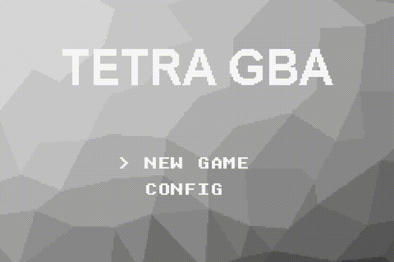

# TETRA GBA

## 概要

テトリスのような落ちものパズルのゲームです。



## 実行方法

実行にはビルド済みのバイナリ（`final.bin`や`final.mb`）が必要です。  
後述する[ビルド方法](#ビルド方法)を参考にビルドを行うか、[Releases](https://github.com/SegaraRai/TetraGBA/releases)からビルド済みのバイナリを入手してください。

### 実機で行う場合

実験で配布された機材がある場合は、実機で実行できます。  
計算機室のmacOSでoptusbを用いるか、あるいはWindowsでも[optusbx](https://github.com/SegaraRai/optusbx)で実機にプログラムを転送できます。  
それらの詳しい使用方法については主専攻実験のマニュアルや、optusbxのウェブページを参照してください。  
転送するプログラムは`final.bin`、`final.mb`のいずれでも大丈夫です（同一の内容です）。

### エミュレータを用いる場合

実機で実行できる環境にない場合は、エミュレータで実行できます。  
ここでは、エミュレータに[Visual Boy Advance - M](https://github.com/visualboyadvance-m/visualboyadvance-m)を用います。  
起動してキー設定を行った後`final.mb`を開くことで実行できます。

## 操作方法

### タイトル画面

|キー  |動作                                        |
|:-----|:-------------------------------------------|
|↑↓  |カーソル移動                                |
|A     |決定                                        |
|START |ゲーム開始（カーソルによらずNEW GAMEを選択）|
|SELECT|ゲーム設定（カーソルによらずCONFIGを選択）  |

### 設定画面

|キー  |動作                                        |
|:-----|:-------------------------------------------|
|↑↓  |カーソル移動                                |
|←→  |選択項目変更                                |
|A     |（RETURN選択時のみ）タイトルに戻る          |
|SELECT|タイトルに戻る                              |

### ゲーム画面

|キー  |動作                                        |
|:-----|:-------------------------------------------|
|←→  |ミノ移動                                    |
|↑    |ハードドロップ                              |
|↓    |ソフトドロップ                              |
|A     |右回転                                      |
|B     |左回転                                      |
|LR    |ホールド                                    |
|START |ポーズ                                      |

### ポーズ画面

|キー  |動作                                        |
|:-----|:-------------------------------------------|
|START |ポーズ解除                                  |
|SELECT|長押しでタイトルに戻る                      |

### ゲームクリア画面、ゲームオーバー画面

|キー  |動作                                        |
|:-----|:-------------------------------------------|
|←→  |統計情報切り替え                            |
|START |再プレイ                                    |
|SELECT|タイトルに戻る                              |

その他タイトル画面と設定画面に隠しコマンド

## ビルド方法

### 必要なもの

- Linux  
  作者はWSL2上のUbuntu 20.04を使用
- [GNU Arm Embedded Toolchain](https://developer.arm.com/tools-and-software/open-source-software/developer-tools/gnu-toolchain/gnu-rm/downloads)  
  `gcc-arm-none-eabi-9-2020-q2-update-x86_64-linux.tar.bz2`をダウンロードし、アーカイブを`/usr/local/`以下に解凍する  
  すると`/usr/local/gcc-arm-none-eabi-9-2020-q2-update/`以下に`arm-none-eabi`、`bin`、`lib`、`share`ディレクトリが存在する形になる
- CMake 3.12 以降
- FFmpeg なるべく新しいもの
- Node.js 12.0.0 以降

### ビルド手順

1. `src/resources/image/`ディレクトリと`src/resources/song/`ディレクトリにて`npm install`コマンドを実行する
2. `build-release.sh`を実行する（作業ディレクトリはリポジトリのルート）

シェルスクリプトで言えば以下の通り。

```sh
pushd src/resources/image
npm install
popd
pushd src/resources/song
npm install
popd
./build-release.sh
```

`build-release/final.bin`にバイナリが出力されます。

また、`build-release/final.mb`にも同一のものが出力されます。  
こちらはエミュレータでの動作確認用に用いることができます。

## 使用素材、帰属表示

### 効果音

以下よりお借りしました。

- [OtoLogic](https://otologic.jp/) (CC BY 4.0)
- [On-Jin ～音人～](https://on-jin.com/)
- [効果音ラボ](https://soundeffect-lab.info/)

### フォント

8x8フォントは[Unscii](http://pelulamu.net/unscii/)を用いました。

また、エフェクト部にはArial Nova、Verdana、Verdana Pro等を用いています。

### 画像

背景画像は[GraphicsFuel](https://www.graphicsfuel.com/)のものを用いました。

### 商標

TetrisはTetris Holding, LLCの登録商標です。
